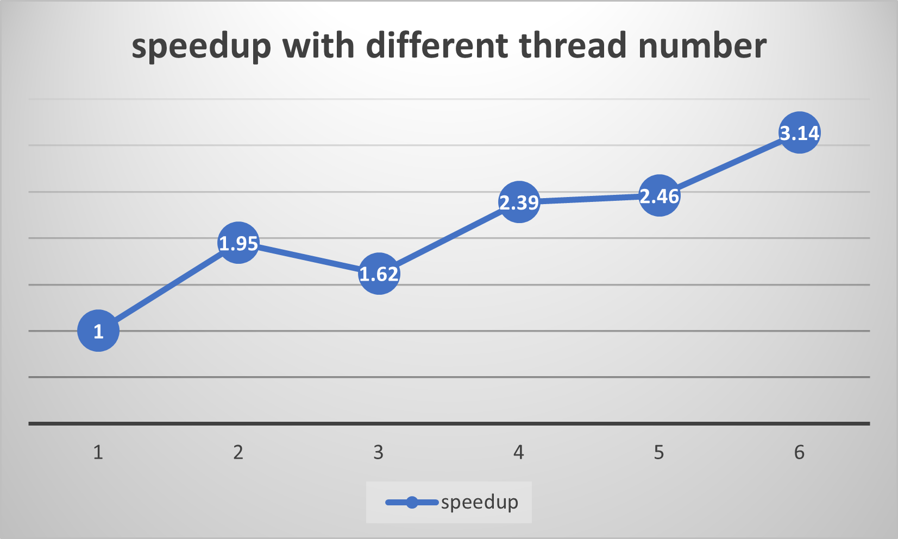
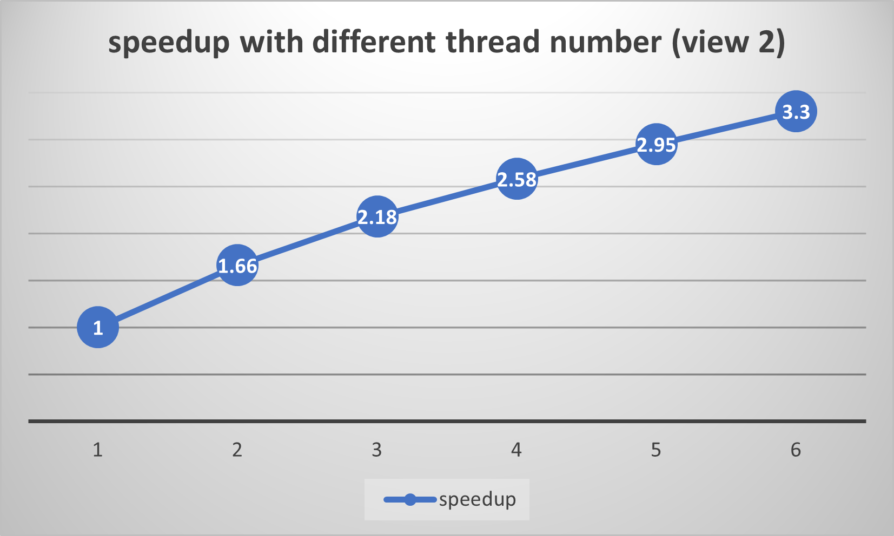

# PP HW2 Part2 report

## Q1
Extend your code to use 2, 3, 4, 5, and 6 threads. (Partitioning the image into blocks for each thread)
> In your write-up, plot a graph of speedup (compared to the reference sequential implementation) as a function of the number of threads used for VIEW 1. Is the speedup linear to the number of threads used? Hypothesize why this is (or is not) the case. (You may want to plot a graph for VIEW 2 for further insights. Hint: take a careful look at the 3-thread data point.)

### view 1
| thread number | speedup |
| -------- | -------- | 
| 1    | 1x  | 
| 2    | 1.95x  | 
| 3    | 1.62x   |
| 4    | 2.39x  |
| 5   | 2.46x   |
| 6   | 3.14x   |

### view 2
| thread number | speedup |
| -------- | -------- |
| 1    | 1x  |
| 2    | 1.66x  |
| 3    | 2.18x   |
| 4    | 2.58x  |
| 5   | 2.95x   |
| 6   | 3.30x   |

### Answer
The speedup is **not** linear to the number of threads used.

因為 `mandel` function 會在符合情況時提早 break 並 return，所以會影響圖中不同地方的計算量，像是如果一直跑到最後的 iteration，也就是 255，那在圖上就會呈現白色，也代表圖中白色處計算量較大，所以會比較慢。

另外用 height 來切不同 thread 工作量，也會使得工作量不均，因為不一定每個部份白色的比例都一樣，所以會有不同 thread 效能差異大的情況 (像是 3 threads 時，中間要計算很多就會拖慢速度)。

## Q2
To confirm (or disprove) your hypothesis, measure the amount of time each thread requires to complete its work by inserting timing code at the beginning and the end of workerThreadStart().
> How do the measurements explain the speedup graph you previously plotted?

<!-- 發現有幾個 thread 會比較慢(不是全部一起慢)，且速度差異大，慢的也不一定只有一個，快的 thread 甚至比 `serial time/thread number` 還快

指定特定 thread number，跑五次，每次比較慢的 thread 都一樣，表示那幾個 thread loading 可能比較重 -->

### Answer
用 height 去分割工作量，可以驗證先前所說，圖裡白色的部分越多，工作量就越大，跑那部分的 thread 會比較慢。
(像是 view 1 中間多白色，所以算中間的 thread 會比較慢，view 2 則是上面多白色，所以 thread 0 會比較慢)

補充: view 1 上下對稱，所以用 height 去切時，`thread number=2` 會有正常的效果 (接近 2x)

## Q3
Modify the work decomposition for threads to achieve a speedup of 3-4x on both views (if you’re above 3.5x that’s fine, don’t sweat it). Your solution may NOT use synchronization between threads. We expect you to come up with a single work decomposition policy that works well for any thread counts—hard-coding a solution for each configuration is not allowed! (Hint: A simple static assignment can achieve this goal without communication/synchronization among threads.)
> In your write-up, describe your parallelization approach and report the final speedup achieved with 4 threads.

### Answer
一樣用 height 切，不過每個連續 pixel 的 height 交給不同 threads 處理，才能更均攤工作量。(像是 view 1 中間那塊白色，就會被實際分給不同 thread 處理，而不會是特定中間的 thread 處理)

<!-- 在 height 越大的情況，應該會有更好的效果。(因為會更均分) -->

Speedup with 4 threads: `3.81x`

## Q4
Now run your improved code with 12 threads using the command: `srun -c 6 ./mandelbrot -t 12`
> Is the performance noticeably better than with 6 threads? Why or why not? (Notice that the workstation server provides 6 threads on 6 cores.)

### Answer
No, it is worse than 6 threads. I think it is because the server only has 6 threads on 6 cores.
Therefore, 12 threads will have context switch, which will degrade performance.
